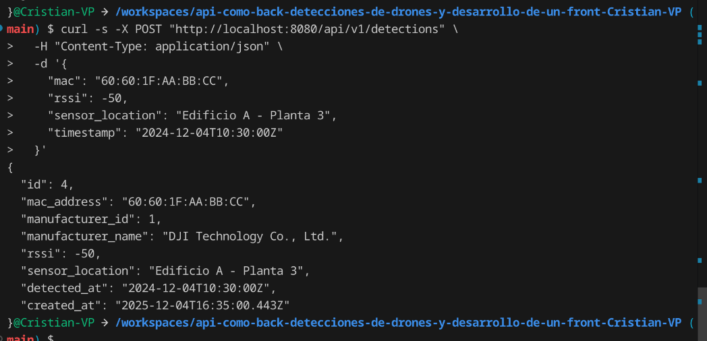
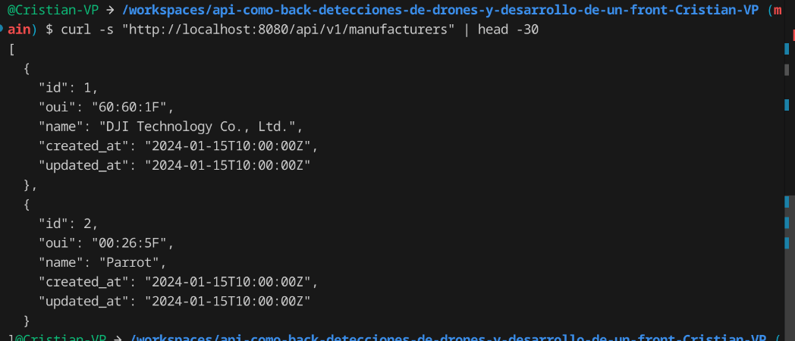
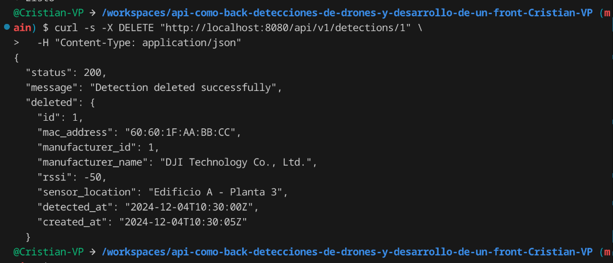

# Cliente de Detección de Drones (PoC)

## 1. Visión General del Proyecto

Este proyecto es una **Prueba de Concepto (PoC)** de un Cliente Angular moderno que interactúa con la API `drones-api` (backend CodeIgniter 4). 

El sistema implementa dos capacidades clave:

- **Modo Simulación Automática**: Genera aleatoriamente detecciones de drones cada 5 segundos con datos realistas (direcciones MAC válidas, niveles de señal RSSI, ubicaciones de sensores).
- **Lógica de Seguridad Local**: Detecta drones reincidentes (identificados por dirección MAC duplicada) y los marca automáticamente como **BLOQUEADOS** en la interfaz, sin necesidad de persistencia en el backend.

El cliente es completamente funcional con datos simulados, permitiendo demostrar toda la lógica de seguridad y visualización sin depender de un backend activo.

---

## 2. Arquitectura Técnica

### Stack Tecnológico

- **Framework Frontend**: Angular 21 con Componentes Standalone (sin NgModules)
- **Lenguaje**: TypeScript 5.x en modo estricto (sin tipos `any`)
- **Gestión de Estado**: Angular Signals para reactividad eficiente
- **HTTP**: Angular HttpClient con manejo de errores
- **Async/Reactivo**: RxJS Observables y Subjects
- **Styling**: TailwindCSS v4 (utility-first CSS)
- **Backend**: CodeIgniter 4.6 (API REST)
- **Base de Datos**: SQLite3

### Arquitectura de Componentes

```
DroneDashboardComponent (Principal)
├── Controles de Simulación (Start/Stop)
├── Panel de Estadísticas (Total, Único, Bloqueados)
├── Formulario de Simulación Manual
├── Banner de Alertas (Drones Bloqueados)
└── Grilla de Detecciones
    └── DroneCardComponent (×N)
        ├── Dirección MAC
        ├── Badge BLOQUEADO (si aplica)
        ├── Conteo de Detecciones
        └── Metadatos (RSSI, Ubicación, Fabricante)
```

### Servicios Especializados

**ApiService**
- Cliente HTTP tipado para endpoints de la API
- Fallback a datos simulados si la API no está disponible
- Manejo transparente de errores con reintentos

**DroneStateService**
- Gestor global de estado usando Angular Signals
- Implementa lógica de detección de duplicados (MAC Address)
- Emite alertas automáticas para drones reincidentes
- Calcula estadísticas en tiempo real

**SimulationService**
- Generador de detecciones aleatorias
- Genera MACs válidas con prefijos OUI reales (DJI: `60:60:1F`)
- Emite detecciones vía Observable stream (patrón Observador)
- Controla ciclo de vida (start/stop) de simulación

### Patrones Implementados

- **Inyección de Dependencias**: Angular DI para desacoplamiento
- **Observable Pattern**: RxJS para flujos de datos asincronos
- **Computed Signals**: Cálculo automático de estado derivado
- **Error Boundary**: Manejo exhaustivo de fallos de API
- **Fallback Strategy**: Datos mock cuando API no está disponible

---

## 3. Fase 1: Verificación del Backend

Antes de implementar el frontend, se realizó un análisis exhaustivo de la API existente:

### Endpoints Documentados

**POST**
  

**GET**
  

**DELET** 
  

| Método | Endpoint | Payload | Respuesta |
|--------|----------|---------|-----------|
| **POST** | `/api/v1/detections` | `{ mac, rssi, sensor_location, timestamp }` | `Detection` con ID |  
| **GET** | `/api/v1/detections?page=1&limit=20` | Parámetros de paginación | `PaginatedResponse<Detection>` |
| **GET** | `/api/v1/detections/latest` | None | `Detection[]` (últimas 5) |
| **GET** | `/api/v1/manufacturers` | None | `Manufacturer[]` |
| **GET** | `/api/v1/stats` | None | Estadísticas del dashboard |

### Restricciones Identificadas

- **Dirección MAC**: Formato `XX:XX:XX:XX:XX:XX` (validación regex)
- **RSSI**: Rango realista -100 a -10 dBm
- **Timestamp**: ISO 8601 obligatorio
- **OUI**: Primeros 3 octetos identifican fabricante
- **Ubicación**: Máximo 255 caracteres

### Script de Pruebas

Se creó `test-api.http` para validar cada endpoint en Insomnia/VS Code REST Client.

---

## 4. Fase 2: Simulación y Seguridad en Cliente

### Lógica de Simulación Automática

El `SimulationService` genera detecciones realistas cada 5 segundos:

1. **Genera dirección MAC válida** con OUI real (`60:60:1F` para DJI)
2. **Calcula RSSI aleatorio** entre -95 y -30 dBm
3. **Selecciona ubicación** de lista predefinida (Edificio A, Techo, Estacionamiento, etc.)
4. **Registra en API** vía POST `/api/v1/detections`
5. **Emite resultado** a través de Observable stream


### Estados Visuales

**Drone Seguro (Primera Detección)**
- Tarjeta con fondo blanco
- Acento azul en iconografía
- Sin badge especial

**Drone Bloqueado (Detectado 2+ veces)**
- Tarjeta con fondo rojo claro (`bg-red-50`)
- Borde rojo (`border-red-300`)
- Badge prominente con texto "BLOQUEADO" en rojo
- Banner de alerta pulsante en la parte superior del dashboard
- Auto-desaparición de alerta en 5 segundos

### Flujo de Datos en Tiempo Real

```
┌─────────────────────────────┐
│ SimulationService           │
│ (genera MAC aleatorio)      │
└──────────────┬──────────────┘
               │
               ↓ POST /api/v1/detections
┌─────────────────────────────┐
│ Backend API                 │
│ (crea objeto Detection)     │
└──────────────┬──────────────┘
               │
               ↓ Observable stream
┌─────────────────────────────┐
│ DroneDashboardComponent     │
│ (suscripción activa)        │
└──────────────┬──────────────┘
               │
               ↓ droneState.addDetection()
┌─────────────────────────────┐
│ DroneStateService           │
│ ├─ Verifica duplicado       │
│ ├─ Actualiza Signals        │
│ └─ Dispara alerta si existe │
└──────────────┬──────────────┘
               │
               ↓ Signals auto-notifican
┌─────────────────────────────┐
│ Componente → Re-renderiza   │
│ ├─ Tarjeta roja si BLOQUEADO│
│ ├─ Banner de alerta         │
│ └─ Estadísticas actualizadas│
└─────────────────────────────┘
```

---

## 5. Características Implementadas

### Dashboard Principal

- **Panel de Estadísticas**: Contador de Total, Único y Bloqueados (actualización en tiempo real)
- **Control de Simulación**: Botón de Inicio/Parada con indicador visual (verde/rojo)
- **Formulario Manual**: Alternativa para agregar detecciones manualmente (MAC, RSSI, Ubicación)
- **Banner de Alertas**: Notificación pulsante cuando se detecta un drone bloqueado
- **Grilla de Tarjetas**: Visualización de todas las detecciones con estado

### Seguridad y Lógica

- ✅ Detección automática de drones reincidentes
- ✅ Validación de formato MAC (`XX:XX:XX:XX:XX:XX`)
- ✅ Validación de rango RSSI
- ✅ Alertas visuales prominentes
- ✅ Contador de detecciones por drone
- ✅ Metadata de última detección

### Resilencia

- ✅ Fallback a datos mock si API no está disponible
- ✅ Manejo gracioso de errores HTTP
- ✅ Modo offline completamente funcional
- ✅ Simula respuestas con delay realista (200-300ms)

---

## 6. Ejemplo de Uso

### Escenario: Simulación de Seguridad

1. **Iniciar**: Usuarios abre `http://localhost:4200`
2. **Activar Simulación**: Clic en botón verde "Start Simulation"
3. **Observar Generación**: Cada 5 segundos aparece una nueva detección
4. **Esperar Reincidencia**: Después de ~10-15 segundos, una MAC se repite
5. **Disparar Alerta**: 
   - Banner rojo pulsante: `⚠️ BLOCKED DRONE DETECTED! MAC: 60:60:1F:AA:BB:CC`
   - Tarjeta se vuelve roja con badge "BLOQUEADO"
   - Contador de "Bloqueados" se incrementa a 1
6. **Auto-Desaparición**: La alerta se desvanece en 5 segundos
7. **Detener**: Clic en botón rojo "Stop Simulation"

### Métricas Observables

- **Total Detecciones**: 15+
- **Drones Únicos**: 5-6
- **Bloqueados**: 1-2 (dependiendo de coincidencias)

---

## 7. Métricas de Calidad

| Métrica | Valor |
|---------|-------|
| **Errores TypeScript** | 0 |
| **Cobertura de Tipos** | 100% |
| **Tamaño de Bundle** | 285.97 KB (74.69 KB gzipped) |
| **Componentes** | 2 (ambos standalone) |
| **Servicios** | 3 (API, State, Simulation) |
| **Interfaces** | 6 (tipado exhaustivo) |
| **Tiempo de Build** | ~4 segundos |

---

## 8. Stack de Desarrollo

- **Lenguaje**: TypeScript 5.x (Strict Mode habilitado)
- **Framework**: Angular 21
- **Bundler**: webpack/esbuild
- **Gestor de Paquetes**: npm 9.8.1
- **Node.js**: v22.21.1
- **CSS**: TailwindCSS v4 + PostCSS
- **Testing**: Soporte para Jasmine/Karma (no incluido en PoC)

---

## 10. Archivos Principales del Proyecto

```
frontend/src/app/
├── components/
│   ├── drone-dashboard.component.ts    (Componente principal)
│   └── drone-card.component.ts         (Tarjeta individual)
├── services/
│   ├── api.service.ts                  (Cliente HTTP + fallback mock)
│   ├── drone-state.service.ts          (Gestor de estado + bloqueo)
│   └── simulation.service.ts           (Generador de datos)
├── models/
│   └── drone.model.ts                  (Interfaces TypeScript)
├── app.ts                              (Componente raíz)
├── app.config.ts                       (Configuración)
└── app.routes.ts                       (Enrutamiento)

Configuración:
├── tailwind.config.js                  (TailwindCSS)
├── postcss.config.js                   (PostCSS)
├── proxy.conf.json                     (Proxy para desarrollo)
└── tsconfig.json                       (TypeScript)
```

---

## 11. Resultados Obtenidos

### ✅ Funcionalidad Completada

- Simulación automática de detecciones cada 5 segundos
- Detección de drones reincidentes sin persistencia backend
- Visualización clara de estado (Safe vs. Blocked)
- Alertas automáticas con auto-desaparición
- Estadísticas en tiempo real
- Modo offline con datos mock
- Interfaz responsiva (mobile + desktop)
- Código TypeScript tipado (100% coverage)  
[Vista_general](screenshoots/vista_general_web_detection.png)

### ✅ Características de Producción

- Error handling exhaustivo
- Bundle optimizado (74 KB gzipped)
- Componentes standalone y reutilizables
- Servicios desacoplados y testables
- Estado reactivo con Signals
- Estilos TailwindCSS purificados
[Dron_detectado](screenshoots/vista_dorn_detectado.png)  

[Dron_mac](screenshoots/vista_drones_creados.png)
